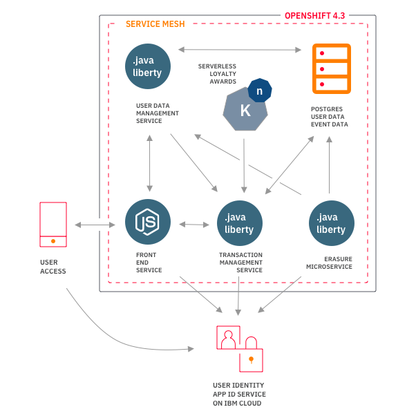

#### Building Secure Micro-Service Apps with OpenShift on IBM Cloud

Cloud development is evolving and maturing as a platform for building secure applications. This post introduces a new open source project that explores security considerations in the context of the new features of OpenShift 4.4. This is not a working banking app, but has been developed to explore and share approaches for creating secure cloud based applications.

#### An example credit card app

This example credit card app is built with just a few straight forward microservices that record dynamic user transactions in a Postgres SQL database. A person can create an account, managed by IBM App ID, and when logged in can hit the various tiles on the app home screen to stimulate randomly priced transactions that are stored in the database. 

You can try out the [credit card example](https://credit-card.ibmdeveloper.net/) for yourself. Create an account ( with a generated name ), return to the homescreen to create some charges that will be stored in a Postgres SQL Database. See how efficiently it all responds in a working version of the app hosted on [Red Hat OpenShift on IBM Cloud](https://cloud.ibm.com/docs/openshift?topic=openshift-getting-started). 

The app is secured with https, and the interaction between the microservices is even encrypted with TLS via the OpenShift Service Mesh. 

Even the build pipline for the app includes a scan of the codebase for security purposes. 

Here is a diagram outlining the architecture of the software:

#### Using this example as a reference example

This credit card project suggests some of the steps that can be built and programmed to create secure microservice based experiences with OpenShift 4.4 in the cloud. It is not a definitive guide, since there are many approaches to security, and every case has unique considerations, but the example provides a decent starting point for considering security and architecture approaches with OpenShift 4.4.

All of the code is opensource, and there are instructions for building and deploying the app, so that it can be explored and learned from. The following links break down the concepts and steps for building the app. 

- [Introduction to OpenShift 4.3](https://developer.ibm.com/articles/intro-to-openshift-4/)
- [Credit Card App Project Architecture](https://github.com/IBM/loyalty#architecture)
- [Introduction to Threat Modeling](https://developer.ibm.com/articles/threat-modeling-microservices-openshift-4/)
- [Fun With Operators](https://developer.ibm.com/tutorials/operator-hub-openshift-4-operators-ibm-cloud/)
- [Building a JEE](https://developer.ibm.com/patterns/privacy-backend-loyalty-app-openshift-4/)
- [GDPR Basic Concepts]()
- [Scaling Securely with OpenShift ServiceMesh]()
- [Extending Apps with OpenShift Serverless]()
- [Building with OpenShift Pipelines](https://developer.ibm.com/tutorials/tekton-pipeline-deploy-a-mobile-app-backend-openshift-4/)

#### Conclusions

The Cloud is fast becoming a necessary platform for building secure and private applications. This example serves two purposes

- share a working integration of OpenShift's latest features
- explore security concepts and approaches for Cloud Native apps

Here at IBM Developer, we plan to use this example to dig deeper into emerging features of OpenShift, and hope to integrate with new [IBM Cloud for Financial Services](ibm.com/cloud/financial-services) which we have not tried yet ... to share some examples from that technology too. Stay tuned to our [work in GitHub](https://github.com/IBM/loyalty).
