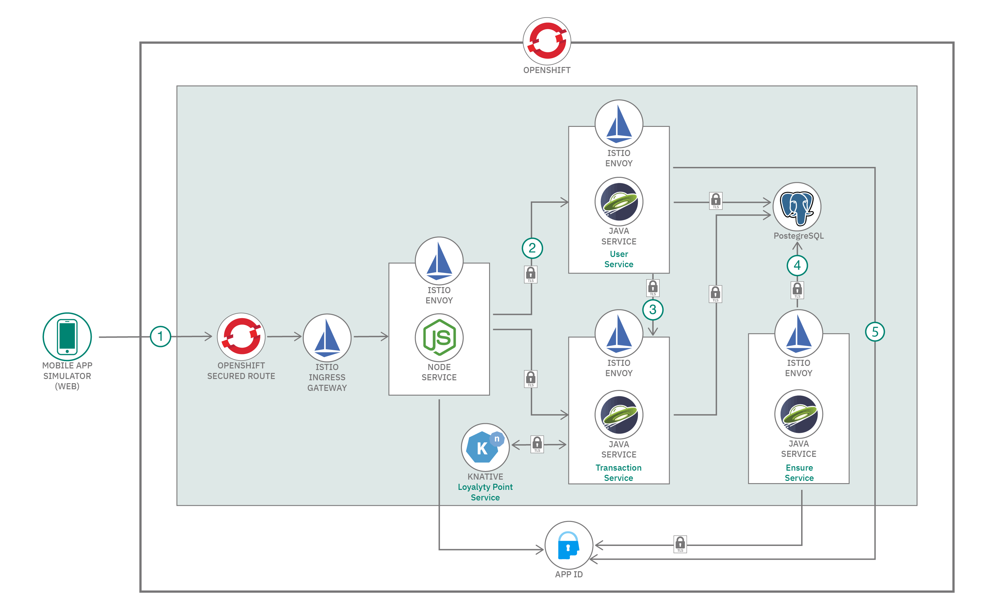
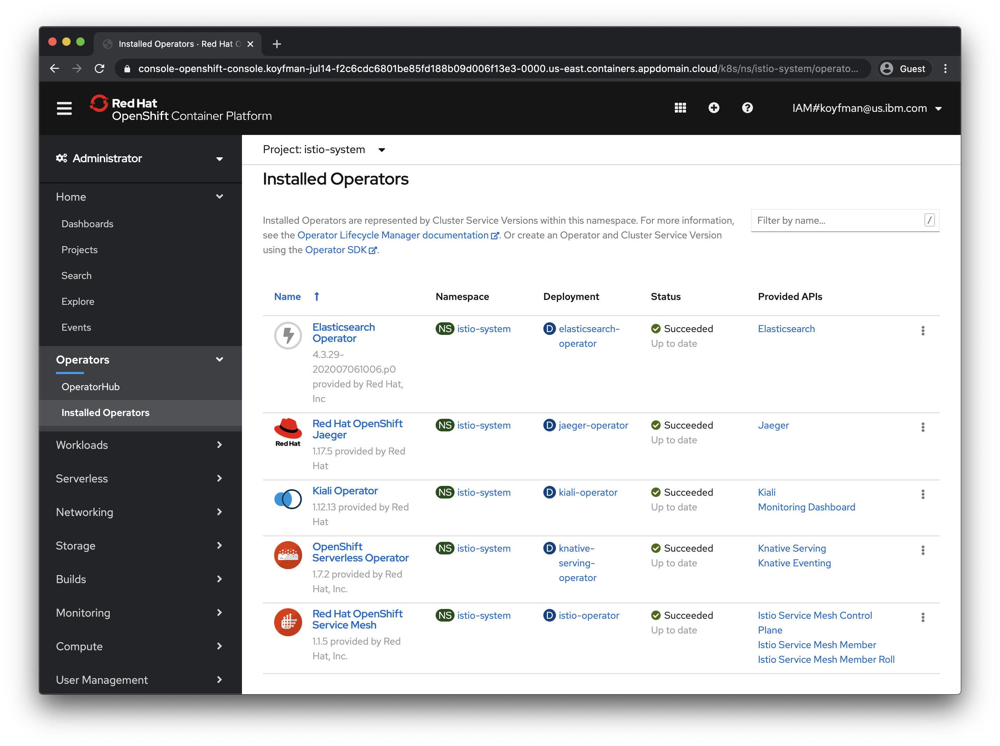
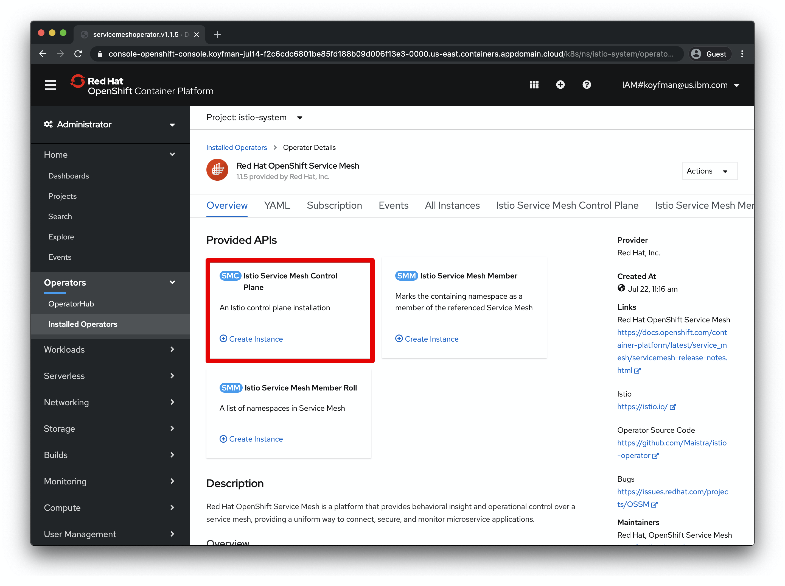
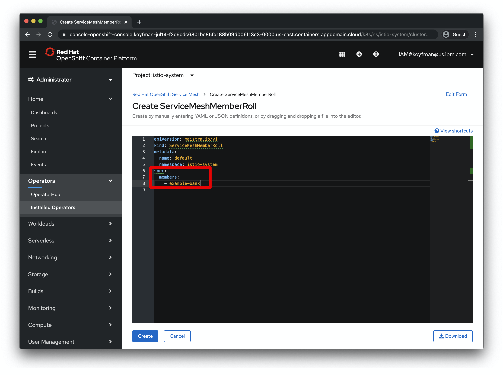
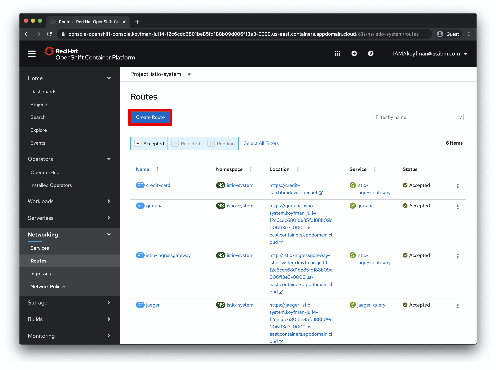
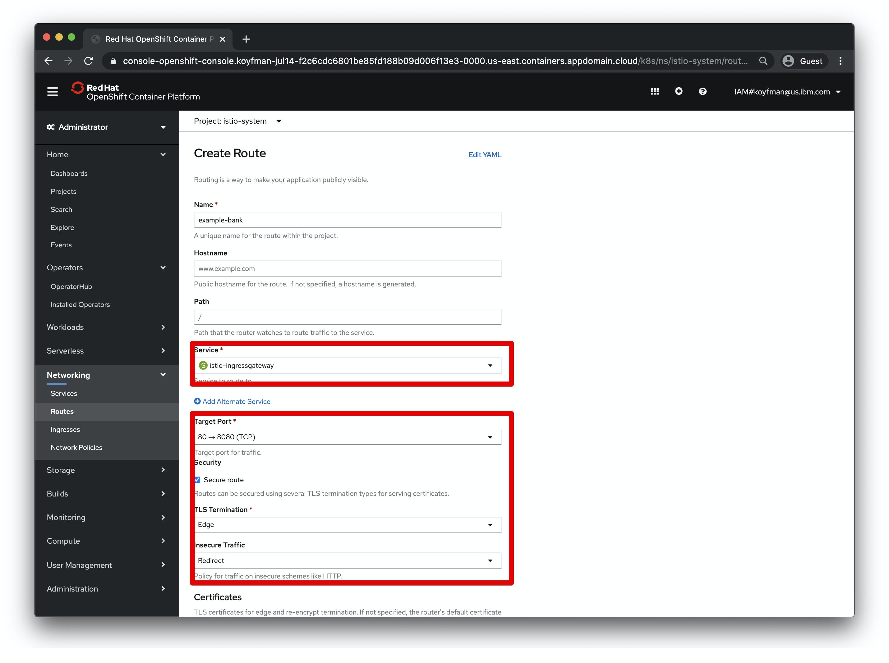
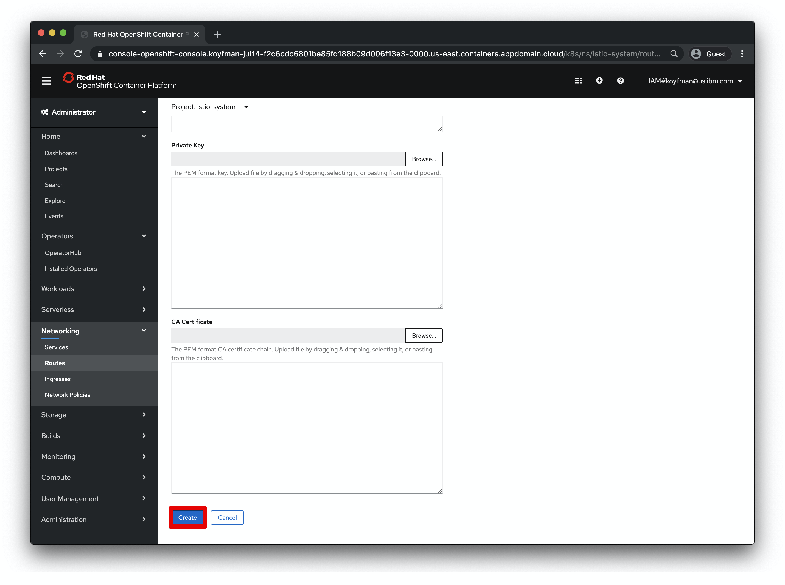
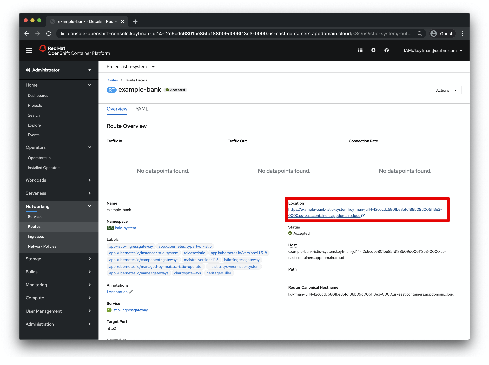
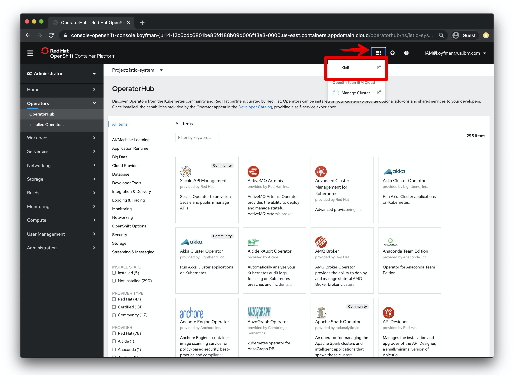
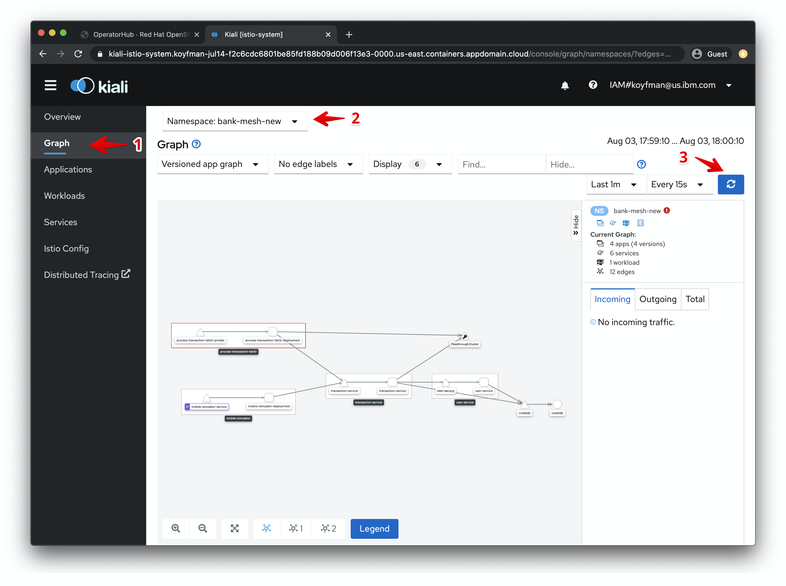

# Microservices with the OpenShift Service Mesh

In this code pattern, we show the steps needed to deploy OpenShift Service Mesh (based on Istio) for the banking simulator microservice back-end described here in the [Building a data privacy focused mobile back-end](https://github.com/IBM/loyalty/blob/main/README.md) code pattern.

## Introduction

The OpenShift ServiceMesh is a layer built on top of Istio, based on the Maistra operator.  In this patter, we show how to take the microservice based application and
make the necessary modifications to deployment scripts, Dockerfiles and network policies to allow it to work with Istio service mesh.  Although the primary goal is security provided by mTLS between services and via the ingress, once Istio is configured, you have all the flexibility of its traffic management and security policies.  In this example, we will install OpenShift Service mesh and configure the Example Bank project to use mutual TLS between services.  Once inside the Istio mesh, you can also take advantage of its traffic management, telemetry and observability features.

## Included Components

- [IBM Managed OpenShift](https://www.ibm.com/cloud/openshift)
- [OpenLiberty](https://openliberty.io)
- [App ID](https://www.ibm.com/cloud/app-id)
- [OpenShift ServiceMesh](https://docs.openshift.com/container-platform/4.3/service_mesh)
- [OpenShift Serverless](https://www.openshift.com/learn/topics/serverless)

## OpenShift Service Mesh vs. Istio

You will see the term "maistra" appear - this is the name of the operator used to implement the OpenShift ServiceMesh. The version of Istio available with OpenShift 4.3 is 1.4.6. 

See the differences between the OpenShift service mesh and upstream Istio here:

- [Compoarison with Istio](https://maistra.io/docs/comparison-with-istio/)
- [OpenShift Service Mesh Architecture](https://docs.openshift.com/container-platform/4.3/service_mesh/service_mesh_arch/ossm-vs-community.html#ossm-vs-community)
- [Maistra releases](https://maistra.io/docs/installation/release-notes/)

# Prerequisites

1. Log in, or create an account on [IBM Cloud](https://cloud.ibm.com)
2. Provision an OpenShift 4.3 cluster on on [IBM Cloud](https://cloud.ibm.com/docs/openshift?topic=openshift-openshift_tutorial)
3. Create a [project](https://docs.openshift.com/container-platform/4.3/applications/projects/configuring-project-creation.html) called `example-bank`.

# Architecture

The following diagram shows the architecture flow of the service mesh for the Example Bank mobile application, which includes several microservices for handling user authentication and transaction mechanics.



1. The user connects to the OpenShift router via HTTPS, which forwards the request to the Istio Ingress Gateway, an Envoy instance.
2. Envoy forwards the request, using gateway and virtual service rules, to the Node.js service, which validates user accounts with App ID.
3. Traffic rules inside the service mesh are set up such that all traffic is intercepted by the Istio Proxy, which enforces security between services. Communication flows between the Node.js service, the Java Transaction service and the Java User management service via mTLS connections proxied by Envoy.
4. The user, transaction, and cleanup services all communicate with the PostgreSQL database inside the cluster. The database itself is also running inside a pod with a proxy container, allowing security and filter rules to be used for database access.
5. The Java erasure service runs once every 24 hours, removing users from App ID. In the Istio environment, jobs like this need to have a delay to wait until the Envoy proxy starts up and is receiving traffic.

This pattern starts with the deployed services and layers on the OpenShift Service Mesh.

## Step 1: Deploy the services

Follow the steps in the [Example Bank application](https://github.com/IBM/loyalty/blob/main/README.md) to deploy all the components of the back-end here.  You will see these services running:

 - Font-end service (Node.js)
 - User management service (Java / OpenLiberty)
 - Transaction processing (Java / OpenLiberty)
 - User cleanup CronJob ( Java / OpenLiberty)
 - serverless (knative) loyalty point service (Node.js)

Ensure that the project they are deployed in is `example-bank`, to match the project in the ServiceMeshMemberRoll instance.

## Step 2: Installing the OSSM Operator

Follow the instructions to install the necessary operators, in this order. (Note: `OSSM` stands for "OpenShift ServiceMesh").

1. ElasticSearch Operator
2. Jaeger Operator
3. Kialie Operator
4. Red Had OpenShift ServiceMesh Operator

Official instructions are here: https://docs.openshift.com/container-platform/4.3/service_mesh/service_mesh_install/installing-ossm.html#ossm-operatorhub-install_installing-ossm

Once comphatlete, your "Installed Operators" screen will show these operators installed.



## Step 3: Control Plane and Member Roll

In this step, we'll use the OSSM operator to create two new instance - a Control Plane and a Service Mesh Member Roll. we'll install the control plane into the `istio-system` project (create a project with this name if not done in the previous step.)  Note that while it is possible to enable global auto-mTLS, we will enabling it selectively only for specific services because global TLS causes issues with triggering the knative transaction processing service.

- Install the Control Plane. No changes from the default template are needed.




- Install the OpenShift Member Roll (Sometimes abbreviated `SMMR`). One change is needed to the default template, noted with the red box. Application pods that are part of an `SMMR` will be managed by this Istio control plane  (e.g. sidecars will not be injected into pods in namespaces not part of a ServiceMesh Member Roll.)



And click "create".

You can verify the project is in the mesh member roll with this (note: requires the OpenShift `oc` CLI.)

```
$ oc get smmr -o yaml --all-namespaces | egrep -A2 'ControlPlane|configuredMembers'
kind: ServiceMeshControlPlane
name: basic-install
uid: 21b19fb5-f8c4-4ab0-831a-86e335ad9999
--
configuredMembers:
- example-bank
meshGeneration: 8
```

## Step 4: Check-out service mesh-enabled branch

Check-out the `service-mesh` branch, which includes modified deployment scripts to allow the application to function in a Red Hat Service Mesh environment.

```
git checkout service-mesh
```

This will checkout updated YAML manifests to enable operations inside the mesh.

## Step 5: Review and apply changes

Let's look at the changes being introduced to allow the Example Bank application to work with the service mesh and run the necessary commands to get our deployments updated.

#### Enable sidecar injection:

Note that there is a new annotation in all the deployment manifests:

```
template:
  metadata:
    labels:
      app: mobile-simulator
    annotations:
      sidecar.istio.io/inject: "true"
```

The `sidecar.istio.io/inject: "true"` is the mechanism the service mesh uses to inject the Envoy proxy into the pod. Note that labeling the namespace to enable sidecar injection for all services will not work with OpenShift. This allows more fine-grained control of which applications use the Istio proxy. 

Let's apply the changes needed for the front-end simulator and two of the Java services:

```
oc apply -f bank-app-backend/user-service/deployment.yaml -f bank-app-backend/transaction-service/deployment.yaml -f deployment.yaml
```

#### Ingress gateway

The Istio ingressgateway is needed to pass traffic into the service mesh.
 
Excerpt from `bank-istio-gw.yaml`: 
```
apiVersion: networking.istio.io/v1alpha3
kind: Gateway
metadata:
  name: simulator-gateway
spec:
  selector:
    istio: ingressgateway # use istio default controller
  servers:
  - port:
      number: 80
      name: http
      protocol: HTTP
    hosts:
    - "*"
```

Note that an OpenShift route is not automatically created from this gateway unless the [Automatic Route Creation (IOR)](https://maistra.io/docs/comparison-with-istio/ior/) feature is enabled.  Later on in the pattern, we'll create a secured route manually, using the OpenShift console.

Delete existing routes and create the Istio gateway:

```
oc delete routes --all
oc apply -f bank-istio-gw.yaml
```

#### Destination rules and policy

Destination rules enable mTLS between services that are inside the mesh. Provided via `bank-istio-destination-mtls.yaml` and `bank-istio-policy.yaml`.  Once applied, these rules enforce encrypted and authenticated traffic between bank services.

```
oc apply -f bank-istio-policy.yaml -f bank-istio-destination-mtls.yaml
```

#### Special steps to enable knative processing.

These steps are necessary to enable traffic routed to knative serving and trigger the creation of the transaction point processing service:

```
oc label namespace knative-serving serving.knative.openshift.io/system-namespace=true --overwrite

oc label namespace knative-serving-ingress serving.knative.openshift.io/system-namespace=true --overwrite

oc apply -f bank-knative-service/network.yaml
```

Note: The namespace in `bank-knative-service/network.yaml` is `example-bank` - this namespace needs to match the one where services are deployed.

Finally, update the knative service deployment:

```
oc apply -f bank-knative-service/deployment.yaml
```
#### Patch the database service to inject the sidecar proxy. 

The database instance must have the Envoy sidecar to properly handle TLS aspects of mesh traffic.

```
$ kubectl patch deployments.apps creditdb -p '{"spec":{"template":{"metadata":{"annotations":{"sidecar.istio.io/inject":"true"}}}}}'
```

Verify that the database pod now contains two containers.

#### User deletion CronJob 

The user deletion cronjob handles cleanup of users who asked to have their
data deleted in the simulator. The run frequency is configurable in the `job.yaml` file. There are two changes need for this job to work in the mTLS mesh environment: 

1. Sidecar pod injection annotation:

```
  jobTemplate:
    spec:
      template:
        metadata:
          annotations:
            sidecar.istio.io/inject: "true"
```

2. Modify the command in the Dockerfile:

```
CMD sleep 30 && java -jar /opt/app/user-cleanup-utility-1.0-SNAPSHOT.jar ; curl -X POST http://localhost:15020/quitquitquit
```

The  `sleep 30`  allows the Istio proxy time to initialize and start before the Java app runs - communication to the other services in the mesh will fail if the sidecar is not running.  The `curl` to `localhost:15020` causes the Istio sidecar to exit after the cleanup completes, allowing Kubernetes to move the job to the `Completed` state.

To deploy this version of the deletion job in the service mesh, delete the existing user  job and apply the new manifest. 

```
oc delete -f bank-user-cleanup-utility/job.yaml
oc apply -f bank-user-cleanup-utility/job.yaml
```

#### Postgres schema loading job

The Dockerfile and `job.yaml` for the Postgres loading job was similarly updated to inject the sidecar and allow time for it to start, as well as to signal to the Envoy proxy to exit when loading completes:

```
$ cat data_model/Dockerfile
FROM postgres
COPY cc_schema.sql /tmp
RUN apt-get update && apt-get install -y curl
CMD /usr/bin/psql postgres://$DB_USER:$DB_PASSWORD@$DB_SERVERNAME:$DB_PORTNUMBER -f /tmp/cc_schema.sql && curl -X POST http://localhost:15020/quitquitquit
```

Note that since the schema was already loaded in the previous code pattern, we don't need to run it again.

#### Verify that each pod has two containers.  

Each application pod will have two containers, one for the application and one fo the Istio proxy:

```
$ oc get pods
NAME                                           READY   STATUS      RESTARTS   AGE
cc-schema-load-tpw2k                           0/2     Completed   2          12d
creditdb-c7cc57d4f-smcmn                       2/2     Running     1          12d
mobile-simulator-deployment-848ff9559b-lldzb   2/2     Running     0          12d
postgresql-operator-6cddd5f47c-c79x4           1/1     Running     0          12d
transaction-service-79d48bf9f-6ts48            2/2     Running     0          12d
user-service-67dcc8c8bd-zsqq7                  2/2     Running     0          12d
```

You can restart individual deployments with `oc rollout restart deployment/<name>` to allow Kubernetes to reload the container and its proxy.

## Verify deployment and create a secure route with OpenShift

Now, let's expose the application in OpenShift with a secure (TLS enabled) route. 

1. Select the `istio-system` project, go to Networking->Routes, and select "Create Route"



2. Set the values as shown in the red boxes here. We are creating a route to the istio ingress gateway that we will be able to access via a `https` URL.



3. Certificate setup. In this scenario, we are using the built-in OpenShift certificates for this cluster subdomain. Custom certificates (e.g. from LetsEncrypt) can be uploaded instead if you have a custom domain name. Right now, we can leave them blank.


4. Create the new route with the default certificates.



5. The application should now be available at this URL:



## Troubleshooting

Setting up rules for Istio traffic can be complex, so it helps to have some tools available to investigate its internals.  Here are two helpful tools.

### 1. `istioctl` CLI

Install the `istioctl` CLI: 

```
curl -L https://istio.io/downloadIstio | ISTIO_VERSION=1.4.6 sh -
```

The `istioctl` CLI has a large variety of subcommands to introspect the configuration of the Istio resources and configurations. See the [documentation](https://istio.io/latest/docs/reference/commands/istioctl/) for more details.

One useful sub-command is `istioctl authn tls-check` - this validates the rules that traffic must follow to be permitted to create connections to application containers:

```
$ istioctl authn tls-check transaction-service-79d48bf9f-6st96 
creditdb.bank-mesh-new.svc.cluster.local:5432                              OK         STRICT         ISTIO_MUTUAL     bank-mesh-new/db-tls                           bank-mesh-new/creditdb
mobile-simulator-service.bank-mesh-new.svc.cluster.local:8080              OK         STRICT         ISTIO_MUTUAL     bank-mesh-new/simulator-tls                    bank-mesh-new/mobile-simulator-service
    STRICT         ISTIO_MUTUAL     bank-mesh-new/transaction-tls                  bank-mesh-new/transaction-service
user-service.bank-mesh-new.svc.cluster.local:9080                          OK         STRICT         ISTIO_MUTUAL     bank-mesh-new/user-tls                         bank-mesh-new/user-service
```

### 2. Kiali 

Kiali, the service graph, can also be used to explore and investigate the mesh configuration, and view traffic in near-real time as it traverses the services.

Open the Kiali console by clicking here in your OpenShift console:



Once the Kiali console is open, you can monitor traffic by:

1. Selecting the "Graph" view
2. Choosing the namespace/project name where the bank services are deployed.
3. Click "refresh" after generating traffic through the mobile simulator.



## License

This code pattern is licensed under the Apache License, Version 2. Separate third-party code objects invoked within this code pattern are licensed by their respective providers pursuant to their own separate licenses. Contributions are subject to the [Developer Certificate of Origin, Version 1.1](https://developercertificate.org/) and the [Apache License, Version 2](https://www.apache.org/licenses/LICENSE-2.0.txt).

[Apache License FAQ](https://www.apache.org/foundation/license-faq.html#WhatDoesItMEAN)


## Resources

More documentation:
https://github.com/Maistra/istio-operator

Installation:
https://maistra.io/docs/installation/operator-installation/
